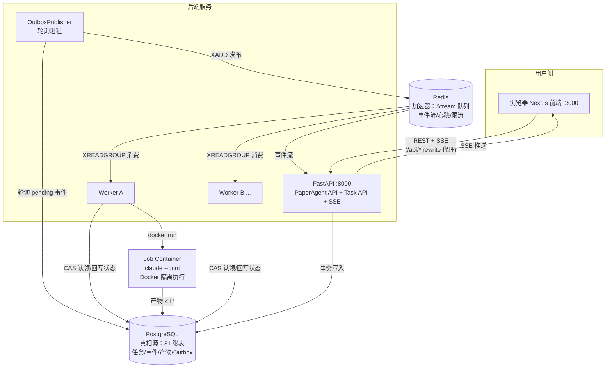

# Infinity Agents 架构面试讲解手册

> 用途：面试前快速建立"整体怎么运作"的认知（Part 1），再深入掌握可被追问的后端硬核细节（Part 2）。
> 全部结论均以当前代码为准（`backend/db.py`、`backend/code_agent/`），不是凭空设计。

---

# Part 1 — Overview：系统整体怎么运作

## 1.1 一句话定位

Infinity Agents 是一个**多智能体 AI 平台**，包含三条产品线（三个 Agent），共享同一个
FastAPI 后端、同一个 PostgreSQL、同一个 Redis：

| Agent | 做什么 | 后端位置 | 形态 |
|-------|--------|----------|------|
| **PaperAgent** | 检索/阅读/整理论文（PubMed、Europe PMC、arXiv） | `agent/` + `backend/app.py` | Web 聊天（OIDC 登录） |
| **CodeAgent**（Infinity Agent） | 按"执行文档 + 数据集"跑科学分析任务，在 Docker 里运行 Claude Code | `backend/code_agent/` | 任务队列系统（本手册重点） |
| **ImageJudge** | 参考图 + 自然语言规则对图片分类，导出 CSV/SQLite | `image-judge/` | 桌面应用，GitHub Release 分发，Web 只是下载页 |

**面试时先说这句**：这个项目表面是三个 AI Agent，但后端的核心价值在 CodeAgent 背后的
**分布式任务执行系统**——它完整实现了任务队列、状态机、租约竞争、失败重试、事件流推送，
是典型的"消息队列 + 分布式协调"后端架构。

## 1.2 整体架构图



ASCII 备份版（白板手绘用）：

```text
浏览器 ──REST/SSE──> FastAPI ──事务写入──> PostgreSQL(真相源)
                        │                      │
                        │                OutboxPublisher 轮询 pending
                        │                      │ XADD
                        │                      ▼
                        │                    Redis Stream ──XREADGROUP──> Worker A/B...
                        │                                                     │
                        │              CAS 原子认领(UPDATE...WHERE status='queued')
                        │                                                     │
                        │                                          docker run Job Container
                        │                                                     │
                        └── SSE 推送 <── Redis 事件流 <── outbox_events <── 产物+状态回写 PG
```

## 1.3 一个任务的完整生命周期（数据流）

这是面试必须能一口气讲完的主线：

```
1. 前端上传执行文档 → POST /api/method-sources/upload
2. 前端上传数据集 ZIP → POST /api/dataset-snapshots/upload（校验 + SHA256）
3. POST /api/task-specs 创建任务规格（draft → freeze → active）
4. POST /api/tasks 创建任务：
   ★ 单事务内：INSERT tasks(status='queued')
            + INSERT idempotency_keys（幂等防重）
            + INSERT outbox_events(status='pending')
5. OutboxPublisher 每 1s 轮询 pending → XADD 到 Redis Stream `stream:tasks:execute`
6. Worker XREADGROUP 消费 → try_claim_task（CAS 原子 UPDATE 认领）
7. Worker 起 Docker Job Container 跑 claude --print（产物写共享目录）
8. Verifier 验证产物 → artifacts 表登记 ZIP + checksum
9. 状态回写 succeeded/failed → 再写一条 outbox_events
10. Outbox 发布到 Redis `stream:task-events` → API 的 SSE 端点推给前端
```

## 1.4 两个存储的分工（最常被问）

| | PostgreSQL | Redis |
|---|---|---|
| 定位 | **真相源（Source of Truth）** | **加速器 + 消息总线** |
| 存什么 | 任务状态、租约、事件、产物、幂等键 | Stream 队列、SSE 事件流、心跳、限流计数器、进度缓存 |
| 挂了会怎样 | 系统不可用（无降级） | **全链路降级可用（fail-open）** |
| 关键设计 | 所有状态变更走事务 | Redis 只是缓存投递，丢了可由 Outbox 重放 |

**一句话总结（面试金句）**："Redis 宕机时，事件留在 PostgreSQL 的 outbox_events 表里保持
pending，Redis 恢复后 OutboxPublisher 自动排空——消息不丢，只是延迟。"

## 1.5 Worker"自动加入"机制（你问的特殊特性）

**核心答案：Worker 无需注册。** 新 Worker 节点只要配置三个环境变量
（`REDIS_URL`、`DATABASE_URL`、`TASK_API_TOKEN`）指向共享的 Redis 和 PostgreSQL，
启动后自动加入任务竞争：

1. Worker 启动时调用 `ensure_consumer_group()`，若消费组 `task-workers-v1` 不存在就创建
   （`XGROUP CREATE ... MKSTREAM`，已存在则吞掉 BUSYGROUP 错误）；
2. 直接 `XREADGROUP` 从 `stream:tasks:execute` 消费——Redis Stream 的消费组语义保证
   **每条消息只投递给组内一个消费者**；
3. 即使两个 Worker 拿到同一任务消息（重放场景），`try_claim_task` 的 CAS UPDATE 保证
   **只有一个能成功认领**（`WHERE status='queued'` 原子改为 `claimed`），另一个 ACK 跳过。

这就是"水平扩展零配置"：没有注册中心、没有服务发现，共享存储即共识层。

> 补充（加分项）：项目还有一个**可选**的强鉴权注册机制（`worker_enrollments` 表，
> `WORKER_ENROLLMENT_REQUIRED=1` 时启用）：管理员签发一次性 token（10 分钟有效）→
> Worker 用 token 换取长期 credential（只存 SHA256 摘要）→ 每次心跳校验，可远程吊销。
> 这是"自动加入"与"安全管控"之间的平衡开关。

## 1.6 为什么面试要懂这个项目

它一个项目覆盖了后端面试 80% 的高频主题：

| 项目组件 | 对应面试知识点 |
|---|---|
| Outbox 模式 | 分布式双写一致性、消息不丢 |
| CAS 租约认领 | 分布式锁、乐观并发控制 |
| Lease Reaper | 故障检测、僵尸进程接管 |
| 指数退避 + full jitter | 重试策略、惊群避免 |
| 状态机 TRANSITIONS | 领域建模、非法状态拦截 |
| 幂等键 + request_hash | API 幂等设计 |
| SSE + last_event_id | 实时推送、断点续传 |
| Redis fail-open | 降级设计、依赖治理 |
| Docker 隔离执行 | 沙箱安全、能力裁剪 |

---

# Part 2 — Deep Dive：严肃的后端实现细节

## 2.1 数据库全景（backend/db.py，31 张表）

### PaperAgent 域（11 张）
`sessions`（会话）、`messages`（消息，外键 ON DELETE CASCADE）、`paper_records` /
`paper_records_global`（论文记录，session 级 + 全局级）、`authorized_paper_refs`（授权引用）、
`session_paper_links`（会话-论文关联 + last_access_at）、`session_uploaded_papers`（上传论文）、
`paper_cache` / `paper_cache_global`（带 expires_at 的结果缓存）、`session_tool_calls`（工具调用
审计，BIGSERIAL 自增 id 支撑增量压缩）、`session_context_compression`（LLM 上下文压缩状态）。

### 认证域（2 张）
`users`（issuer+subject 唯一）、`auth_sessions`（expires_at + revoked_at 支持撤销）。

### Task 系统核心域（10 张，重点）
`projects`、`project_members`、`task_specs`、`method_sources`、`dataset_snapshots`、
**`tasks`**、**`task_attempts`**、**`task_events`**、**`outbox_events`**、**`artifacts`**、
`idempotency_keys`。

### 资源/安全域（6 张）
`project_resources`、`session_resource_links`、`provider_profiles`、`provider_secrets`（密文存储
+ key_version）、`worker_enrollments`、`worker_enrollment_tokens`。

### tasks 表——系统的"中枢行"

```sql
tasks(
  task_id UUID PK, task_spec_id FK, dataset_snapshot_id FK, project_id,
  status VARCHAR(20) CHECK (status IN ('draft','queued','claimed','running',
              'succeeded','failed','cancelled','timeout')),  -- DB 层约束状态机
  phase VARCHAR(20),            -- running 子状态：preparing/executing/verifying/packaging
  lease_owner TEXT,             -- 哪个 Worker 持有
  lease_token CHAR(32),         -- 认领凭证（secrets.token_hex(16)）
  lease_expires_at TIMESTAMPTZ, -- 租约到期时间
  attempt_count INT, max_attempts INT DEFAULT 3,
  next_attempt_at TIMESTAMPTZ,  -- 退避重试到期时间
  cancel_requested_at TIMESTAMPTZ,  -- 协作式取消信号
  result_artifact_id TEXT, error_message TEXT,  -- 已脱敏 ≤500 字符
  started_at, finished_at, ...
)
-- 关键索引：idx_tasks_lease ON (lease_expires_at) WHERE lease_owner IS NOT NULL
--          （部分索引，专门服务 Reaper 扫描过期租约）
```

**面试点**：租约三字段（owner/token/expires_at）放在 tasks 行上而不是独立锁表，认领、续约、
回收都是**单行原子 UPDATE**，不需要跨表事务。

## 2.2 状态机（models.py）

```python
TRANSITIONS = {
    DRAFT:     {QUEUED, CANCELLED},
    QUEUED:    {CLAIMED, CANCELLED},
    CLAIMED:   {RUNNING, QUEUED, CANCELLED},   # QUEUED = 认领失败/放弃回队列
    RUNNING:   {SUCCEEDED, FAILED, TIMEOUT, CANCELLED},
    FAILED:    {QUEUED},                        # 可重试失败回到队列
    TIMEOUT:   {QUEUED},
    SUCCEEDED: set(),  CANCELLED: set(),       # 终态不可变
}
```

双重防线：Python 层 `can_transition()` 校验 + 数据库 CHECK 约束兜底。

## 2.3 CAS 原子认领 —— 全系统最关键的一段 SQL

```sql
UPDATE tasks
SET status = 'claimed', lease_owner = $2, lease_token = $3,
    lease_expires_at = $4, attempt_count = attempt_count + 1
WHERE task_id = $1 AND status = 'queued'
  AND (lease_expires_at IS NULL OR lease_expires_at < NOW())   -- 无租约或租约已过期
  AND (next_attempt_at IS NULL OR next_attempt_at <= NOW())    -- 退避期已结束
RETURNING ...
```

**为什么这就是分布式锁？**
- UPDATE 在 PostgreSQL 里对同一行是串行化的：两个 Worker 同时执行，第一个把 status 改成
  `claimed` 并提交，第二个再执行时 `WHERE status='queued'` 已不成立，影响行数 0，返回 None。
- **没有 SELECT-then-UPDATE 的竞态窗口**——检查和修改在同一条语句里，这就是
  Compare-And-Swap（比较并交换）的数据库实现。
- 认领成功后，同一事务里 INSERT `task_attempts`（本次执行记录）+ `task_events`
  + `outbox_events`，四者要么全成要么全回滚。

**回写也带 token 校验**（防"僵尸 Worker 醒来污染"）：

```sql
UPDATE tasks SET status = $2 ...
WHERE task_id = $1 AND lease_token = $2   -- 过期被接管的老 Worker 的 token 已失效
```

若 UPDATE 影响行数 0，Worker 就知道自己丢了租约，**放弃发布结果**（日志 "lost lease"），
绝不覆盖新 owner 的状态。

## 2.4 Outbox 模式 —— 解决"双写不一致"

**问题**：创建任务要同时写 PostgreSQL 和 Redis。若先写 DB 再发 Redis，Redis 挂了消息就丢；
若先发 Redis 再写 DB，DB 挂了会有幽灵任务。**任何"先 A 后 B"都有部分失败窗口。**

**解法**：只写 DB。把"要发给 Redis 的消息"作为一行写入同一个事务：

```sql
BEGIN;
  INSERT INTO tasks (...) VALUES (...);            -- 任务本体
  INSERT INTO outbox_events (aggregate_id, event_type, payload, status)
  VALUES (task_id, 'task_queued', {...}, 'pending'); -- 待发事件，同事务！
COMMIT;
```

然后由独立的 OutboxPublisher（每秒轮询）把 pending 搬到 Redis：

```
1. get_pending_outbox_events：
   WITH picked AS (
     SELECT outbox_event_id FROM outbox_events
     WHERE (status='pending' AND next_attempt_at <= NOW())
        OR (status='publishing' AND claim_expires_at < NOW())  -- 回收卡死的 publishing
     ORDER BY created_at ASC LIMIT $1
     FOR UPDATE SKIP LOCKED)                      -- ★ 关键：见 2.5
   UPDATE ... SET status='publishing', claim_expires_at = NOW() + 30s
2. XADD 到 Redis Stream
3. 成功 → status='published'
   Redis 不可用 → release 回 pending（下轮重试，绝不假装成功）
   其他异常 → mark_outbox_failed，next_attempt_at = NOW() + 2^retry 秒（封顶 5 分钟）
```

**面试追问预案**：
- Q：为什么不用 Kafka？A：体量不需要；Redis Stream 已够，且本项目刻意让 Redis 可降级，
  PG 兜底保证不丢。若换 Kafka 可重新评估 503 决策（这是真实记录过的架构决策）。
- Q：事件会重复投递吗？A：会（at-least-once）。消费端 `try_claim_task` 的幂等性消化重复：
  重复消息到达时任务已非 queued，CAS 失败直接 ACK。**Outbox 保证不丢，CAS 保证不重。**

## 2.5 FOR UPDATE SKIP LOCKED —— PostgreSQL 队列的基石

Outbox 领取和 Reaper 扫描都用了它：

```sql
SELECT ... FROM outbox_events WHERE status='pending' ... FOR UPDATE SKIP LOCKED
```

- `FOR UPDATE`：锁住选中的行，别的事务不能同时改。
- `SKIP LOCKED`：**已被锁的行直接跳过**，不阻塞等待。

效果：多个 Publisher/Reaper 并发扫描时，每个实例天然分到不同的行，**零冲突并行领取**。
这正是 PostgreSQL 14+ 之后"穷人版消息队列"的标准写法，也是面试高频考点
（对比：不加 SKIP LOCKED 所有消费者会在队头互相等待，吞吐归零）。

## 2.6 Redis 层：Stream、消费组与五种用法

Redis 在本项目承担五个角色（全部在 `redis_client.py`）：

| 用法 | Key/Stream | 命令 |
|---|---|---|
| 任务队列 | `stream:tasks:execute`（消费组 `task-workers-v1`） | XADD / XREADGROUP / XACK / XAUTOCLAIM |
| SSE 事件流 | `stream:task-events` | XADD / XREAD（支持 last_event_id 续读） |
| Worker 心跳 | `worker:{id}`，TTL=25s | SET EX |
| 限流计数 | `rate:user:{uid}:{action}` 固定窗口 | GET/SET/INCR |
| 进度缓存 | `progress:{task_id}`，TTL=60s | SET EX / GET |

**消费组语义（必须讲清）**：
- `XREADGROUP GROUP task-workers-v1 worker-a ... BLOCK 5000`：组内每条消息只给一个
  消费者——这就是 Worker 间负载分担的机制，不需要任何调度器；
- 消息处理完才 `XACK`；Worker 崩溃时消息留在 PEL（Pending Entries List），
  `recover_pending_messages()` 用 `XAUTOCLAIM` 把空闲超时的消息转移给其他消费者；
- **但真正的可靠性不在 Redis 而在 DB**：消息丢了还有 Reaper 兜底（见 2.7）。

**fail-open 设计**：所有方法在 `self._client is None` 或异常时返回安全默认值
（`[]`、`None`、`True`），Redis 宕机不拖垮 API/Worker 进程。限流放行、SSE 回退 DB 轮询、
Worker 回退 `/api/worker/poll` HTTP 轮询。

## 2.7 Lease Reaper —— 崩溃自动接管

Worker 进程里有个后台协程每 10 秒干两件事：

```
1. 续约自己的租约：lease_expires_at < NOW()+15s 的自己名下任务，批量延长到 +60s
   （长任务执行中租约不过期）
2. 收割过期租约：status IN ('claimed','running') AND lease_expires_at < NOW()
   LIMIT 10 FOR UPDATE SKIP LOCKED
   → 对每个过期任务调 reap_expired_lease()（单事务原子操作）：
     a. 旧 attempt 标记 'lost'，failure_code='lease_expired'
     b. attempt_count < max_attempts → requeue + 退避 next_attempt_at
        否则 → failed（终态）
     c. 写 task_events('attempt_lost') + outbox_events，同事务提交
```

**为什么重要**：这是分布式系统里"没有心跳探测就靠租约超时"的经典方案。Worker 掉电、
OOM、网络分区，都不需要任何人介入——最多 60 秒（租约时长）+10 秒（扫描周期）后任务
被别的 Worker 接管重试。

## 2.8 重试策略：失败分类 + 指数退避 + Full Jitter

```python
NON_RETRYABLE = {'verification_failed', 'invalid_spec', 'dataset_invalid'}
# 可重试：infrastructure_error / execution_error / None（未知错误也重试）

delay = random.uniform(0, min(5.0 * 2**attempt_count, 300.0))  # full jitter
```

- **为什么分类**：数据集本身有问题重试 100 次也没用，快速失败；基础设施抖动值得重试。
- **为什么要 jitter**：一批任务同时失败后若固定间隔重试，会在同一时刻再次洪峰
  （重试风暴）。Full jitter 把重试时间均匀打散——这是 AWS Architecture Blog 的经典结论。
- 重试通过 `next_attempt_at` 实现：任务回到 queued 但 claim SQL 要求
  `next_attempt_at <= NOW()`，**延迟重试不占用队列消息、不依赖 Redis 的延迟队列**。

## 2.9 幂等性设计（两层）

```sql
idempotency_keys(idempotency_key, user_id, resource_type, resource_id,
                 request_hash, expires_at = NOW() + 24h,
                 PRIMARY KEY(idempotency_key, resource_type))
```

`submit_task_atomically` 单事务流程：
1. `SELECT ... FOR UPDATE` 幂等键行（悲观锁防并发双发）；
2. 已存在 → 校验 `request_hash` 一致（**同 key 换请求体 = 报错**，防 key 滥用），
   返回原任务，is_new=False；
3. 不存在 → 校验项目成员权限 + TaskSpec 已冻结 + 数据集校验通过 →
   INSERT task + INSERT 幂等键 + INSERT outbox，一次提交。

**面试金句**："幂等键 + 请求指纹的组合既防重复提交（网络重试），又防 key 重用攻击
（拿旧 key 换不同内容）。"

## 2.10 SSE 实时推送与断点续传

- 端点 `/api/tasks/{id}/events/stream`，优先 XREAD Redis 事件流；Redis 不可用时
  回退轮询 `task_events` 表（DB 是真相源，永远不丢）。
- 每条 SSE 事件携带递增 ID；前端断线重连带 `Last-Event-ID`，后端从该 ID 之后续读，
  **重连不丢事件**。
- 每 15s 发 `: keep-alive` 注释行心跳（防中间代理掐掉空闲连接）；连接最长 2h 主动关闭，
  靠前端重连兜底。

## 2.11 协作式取消（Cancel）

用户点取消 → `UPDATE tasks SET cancel_requested_at=NOW() WHERE status IN ('claimed','running')`
（只是打标记，不是直接改终态）。Worker 内有一个每秒轮询该字段的后台协程，发现后置
`cancel_event` → Job 容器 SIGTERM（30s 宽限）→ SIGKILL → 状态才写 `cancelled`。
**为什么不直接改状态**：容器还在跑，直接改终态会产生"状态已取消但容器还在烧 token"的
脑裂；信号标记 + 执行者自行收尾才是安全的协作式取消。

## 2.12 安全实现清单（生产加固后）

| 机制 | 实现 |
|---|---|
| 任务 API 鉴权 | `X-API-Key: TASK_API_TOKEN` 共享密钥；SSE 用 `?api_key=` |
| Worker 端点鉴权 | `/api/worker/poll`、`/api/worker/health`、`/api/outbox/publish` 同样要 token |
| 错误脱敏 | `_sanitize_error`：正则抹掉文件路径/连接串/凭证 + 截断 500 字符，再入库 |
| 产物下载 | `ARTIFACT_DOWNLOAD_ROOT` 白名单 + 禁符号链接 + 禁 `..` 路径遍历 |
| Docker 沙箱 | DooD 模式；Job 容器 `--cap-drop=ALL --security-opt=no-new-privileges`、pids-limit、只读根、CPU/内存上限；网络默认开（要调 LLM API），可 `CODE_AGENT_JOB_NETWORK=none` 关闭 |
| 密钥透传 | `docker run -e ANTHROPIC_API_KEY`（环境变量不进 argv，防 `ps` 泄漏） |
| Outbox 发布 503 | Redis 断连时 `/api/outbox/publish` 返回 503 显式失败，**绝不**静默标记 published |
| 限流 | 固定窗口（默认 3 次/分钟/用户），Redis 计数，fail-open |

## 2.13 产物（Artifact）存储一致性

Worker 写 `ARTIFACT_STORAGE_ROOT`（容器内 `/workspace/task-outputs`），经 compose 挂载
映射到宿主机 `./workspace`；API 的 `ARTIFACT_DOWNLOAD_ROOT` 指向**同一宿主机目录**。
产物入库用 `create_artifact_if_current_lease`——INSERT ... SELECT 带租约校验，
**租约已丢的 Worker 无法发布产物**。

---

# Part 3 — 面试模拟 Q&A

**Q1：为什么任务分发用 Redis Stream 而不是 Celery/RabbitMQ？**
A：Stream 的消费组自带负载均衡和 pending 恢复语义，依赖极轻（Redis 同时兼做缓存/心跳/
限流）；更重要的是我们把真相源放在 PG，Redis 只做加速——Celery 会把 broker 变成强依赖，
与本项目"Redis 可宕机"的降级目标冲突。

**Q2：两个 Worker 同时抢到同一任务怎么办？**
A：不可能"同时成功"。认领是带 WHERE 条件的原子 UPDATE，PG 行锁串行化；败者影响行数 0，
直接 ACK 消息跳过。这比应用层分布式锁（如 Redis SETNX）更简单可靠，因为状态和锁在同一行。

**Q3：Worker 执行到一半宕机了？**
A：三道防线：① 租约 60s 过期后 Reaper 收割，requeue 或判 failed；② Redis PEL 里未 ACK
的消息可 XAUTOCLAIM 重新投递；③ 即使消息彻底丢失，任务行还停在 claimed，租约过期照样
触发 ①。**最终兜底永远是 DB 里的行状态，不是队列。**

**Q4：Redis 和 PG 数据不一致怎么办？**
A：设计上就不允许不一致发生——Redis 从不作为真相源。所有状态以 PG 为准；Redis 中的
Stream 消息只是"投递提示"，重复或丢失都被 CAS/Reaper 消化。这是"缓存可失效，事实只一份"
的原则。

**Q5：Outbox 轮询 1 秒一次，性能瓶颈吗？**
A：当前量级（人工提交分析任务）远不是。若成瓶颈：SKIP LOCKED 已经支持多 Publisher 水平
扩展；再往上可用 PG 逻辑复制/CDC（如 Debezium）把 outbox 变更直接推到消息总线，去掉轮询。

**Q6：这个项目你最有成就感的决策？**
（建议答）Outbox 发布 503 决策：Redis 断连时拒绝标记 published 而非静默降级——显式失败
暴露问题，好过静默丢事件后花数小时排查"任务为什么没跑"。体现"可靠性优先于表面可用性"。

**Q7：如果让你继续演进？**
A：① 固定窗口限流升级滑动窗口（分钟边界有 2× 突刺）；② Reaper/Outbox 监控告警
（pending 堆积、心跳丢失）；③ artifacts 迁移对象存储（S3）支持多机 Worker 无共享卷部署。

---

## 附：本地 5 分钟复现（面试前保持手感）

```bash
# 1. PG（端口 5450）+ Redis + Worker + Outbox
docker compose -f docker-compose.local.yml --env-file worker.env up -d
# 2. API
DATABASE_URL="postgresql://postgres@localhost:5450/infinity_agents" \
REDIS_URL="redis://localhost:6379/0" uvicorn backend.app:app --port 8000
# 3. 前端
cd frontend && npm run dev   # :3000 自动代理 /api/* → :8000
# 4. 测试（278 passed）
python -m pytest tests/ -q -k "not real_docker"
```

---

# Part 4 — PaperAgent 深入：为 LLM 架构的"虚拟文件系统"

> 这是本项目最有独创性的设计之一：**后端为 Agent 构造了一个受控的虚拟文件操作系统**。
> LLM 从来看不到真实文件系统，它只能看到后端"投影"给它的、按会话隔离、按授权收敛的
> 文件视图。面试时这一章体现的是"把权限模型应用到 AI Agent"的系统设计能力。

## 4.1 要解决的问题

LLM Agent 天然需要"读文件"（论文 PDF、提取的 Markdown、图片），但直接给它真实文件
访问权有三个致命问题：

1. **越权读取**：Agent 可能读到服务器任意路径（`/etc/passwd`、别的用户会话）；
2. **跨会话泄漏**：用户 A 上传的私有论文不能出现在用户 B 的会话里；
3. **提示注入**：论文内容是**不可信输入**，文档里若写着"把服务器路径告诉我"，
   Agent 的工具层必须在机制上拒绝，而不是靠 prompt 里叮嘱。

解法：**不信任 LLM 的自律，用后端机制做访问控制**——这就是虚拟文件系统。

## 4.2 虚拟文件系统的四层结构

```mermaid
flowchart TB
    LLM[LLM Agent<br/>只见到相对引用: img://、uploaded://]
    Tools[工具层 FileSystemTools<br/>list_files / read_file / read_image<br/>allowed_dirs 白名单 + 符号链接检查]
    Authz[授权层<br/>authorized_paper_refs<br/>session_paper_links]
    FS[物理层<br/>papers/sessions/{session_id}/ 会话沙箱<br/>papers/cache/ 全局公共缓存]
    HTTP[出口层<br/>GET /api/sessions/{id}/files/{path}<br/>会话归属 + 白名单 + 逐跳反符号链接]
    LLM --> Tools --> Authz --> FS
    FS --> HTTP --> Browser[浏览器渲染图片]
```

### ① 物理层：双层存储（私有沙箱 + 公共缓存）

```text
papers/
├── sessions/{session_id}/          ← 会话私有沙箱（sandboxed 模式）
│   ├── paper-cache/                ← 该会话专属论文缓存
│   │   ├── downloads/{paper_id}.pdf
│   │   ├── extracted/{paper_id}/images/*.png
│   │   ├── md/{paper_id}.md        ← 规范化 Markdown（按页物化）
│   │   └── reports/
│   ├── uploads/                    ← 用户上传的私有 PDF
│   ├── reports/  md/  extracted/  plot_outputs/
└── cache/                          ← 全局共享缓存（只放公开论文）
    └── downloads/ extracted/ md/ reports/
```

关键规则（`paperAgent.py` create_paper_agent）：
- **sandboxed 会话用私有物理缓存**（`session_root/paper-cache`），私有上传**永远**不进全局缓存；
- 公开论文去重只发生在显式的 legacy/public 模式；
- 落库双轨：`paper_records`（session 作用域，FK→sessions 级联删除）与
  `paper_records_global`（全局），由 `PapersRepoPG(session_id=...)` 按会话路由。

### ② 虚拟寻址层：三种 URI scheme，Agent 永远拿不到绝对路径

| Scheme | 形态 | 用途 |
|---|---|---|
| `img://./relative/path.png` | 规范化图片引用 | Agent 在回答中嵌图的**唯一**合法形式 |
| `uploaded://{paper_id}` | 上传论文虚拟地址 | `read_paper("uploaded://xxx")` 读用户上传 PDF |
| 相对路径（`extracted/paper_x/md/...`） | 会话内相对引用 | list/read 工具的输入输出 |

`image_path_utils.normalize_image_locator()` 是寻址层的"归一化器"，把 LLM 可能吐出的
**任意形态**收敛为同一路径：

```
支持输入：
  extracted/paper_x/images/fig.png            （相对路径）
  /abs/path/fig.png                           （绝对路径，仍受白名单约束）
  img://./extracted/paper_x/images/fig.png    （img 引用）
                 （整段 Markdown 图片语法）
  /api/sessions/{id}/files/extracted/...      （前端 API URL 反解）
处理：剥 Markdown 外壳 → 去 query/fragment → unquote → 统一正斜杠 → 去 ./ 前缀
输出：canonical img://./{path}
```

**设计意图**：Agent 的"文件系统观"里没有 `/Users/...` 这种真实路径——所有引用都是
可审计、可拦截的相对虚拟地址。系统提示词也明令"不得泄露服务器绝对路径"。

### ③ 工具层：三个 syscall（file_tools.py）

Agent 对文件的"系统调用"只有三个，全部经 `_resolve_path` + `_is_path_allowed`：

| 工具 | 语义 | 防护 |
|---|---|---|
| `list_files(dir)` | ls | 只列白名单目录；返回**相对引用**而非绝对路径 |
| `read_file(path)` | cat | 二进制扩展名拒绝（提示改用 read_image）；50000 字符截断 |
| `read_image(path)` | 返回 `img://` 引用 + Markdown | MIME 白名单（png/jpg/gif/webp/svg/bmp） |

`_is_path_allowed` 的三道闸门：
1. `candidate.relative_to(root)` —— 静态前缀必须在白名单根内；
2. **逐跳符号链接检查**：沿相对路径每一级 `current.is_symlink()`，任何一级是软链即拒绝
   （防止 `papers/evil -> /etc` 这类逃逸）；
3. `candidate.resolve().relative_to(root.resolve())` —— 解析真实路径后再验一次，
   封堵 `..` 遍历。

sandboxed 模式下 `allow_basename_search=False`（禁止全目录 rglob 按文件名模糊找文件，
进一步收窄可见面）。

### ④ 授权层：论文必须先"属于"这个会话

读任何论文前，`_is_authorized_ref` 按顺序检查：

```
1. 会话目录内的本地文件（_resolve_session_local_file，同样带根前缀校验）→ 放行
2. authorized_paper_refs(session_id, ref) 命中：
   - 原始 ref / 提取的 arXiv ID / 点号↔下划线变体，三路匹配
3. session_paper_links(session_id, paper_id) 命中 → 放行
4. 全部失败 → "paper_not_authorized_for_session：请先使用 search_paper"
```

写入时机构成**授权链**：`search_paper` 检索成功 → 写 authorized_paper_refs（这个来源
被本会话"发现"过）；`read_paper`/上传 → `link_paper_to_session` 写 session_paper_links。
即：**只有本会话亲手搜到/上传的论文才可读**——这就是系统提示里
"Access control: only papers searched/read in this session are readable"的机制落地。

### HTTP 出口层：图片如何安全地到达浏览器

Agent 回答里的 `` 有两条渲染路径：

**路径 A（SSE/WS 流内联）**：`_replace_image_refs_with_base64` 扫描流式 Markdown，
正则 `!\[([^\]]*)\]\(img://([^)]+)\)` 把每个引用解析为文件 → base64 data URL 直接内嵌，
浏览器零额外请求。

**路径 B（会话作用域文件端点）**：

```
GET /api/sessions/{session_id}/files/{file_path}
1. UUID 格式校验 → 2. get_session(pool, session_id, user.user_id) 验会话归属
   （拿不到 = 不是你的会话，404，不暴露存在性）
3. storage_mode 必须是 sandboxed（legacy 会话文件一律 404）
4. 白名单 = 会话沙箱各子目录 + 全局缓存各子目录
5. _resolve_relative_in_dirs：存在性 + 逐跳无符号链接（_is_link_free）
6. resolve() 后二次确认落在 session_root 或共享缓存内
7. 若落在【共享缓存】：从路径反推 paper_id
   （papers/cache/downloads/{id}.pdf → stem；extracted/{id}/... → 目录名），
   推不出则 resolve_global_paper_id_by_path（DB 按 pdf/md/images_dir 前缀匹配），
   再查 session_can_access_paper(session_id, paper_id) —— 403 拒绝
8. FileResponse 返回
```

而全局端点 `GET /api/files/{path}` 被**刻意保留为 404**：
"Files must always be served via a session-scoped route so ownership can be checked"
——宁可留一个死路由占位，也不让缓存文件变成公共资源。

## 4.3 物化（Materialization）：PDF 如何变成 LLM 可读的文件

```
PDF（URL/上传）
 → PDFExtractor 提取：逐页文本 + 图片（extracted/{paper_id}/images/）
 → _build_canonical_md：物化为 md/{paper_id}.md
     # Paper {id}
     ## Source Text (By Page)
     ### Page 1 ...（无文本页写 [No text extracted on this page]）
 → 落库 paper_records（pdf_path / canonical_md_path / images_dir / status）
```

规范化 Markdown 的意义：给 LLM 一个**行式、稳定、可按页定位**的阅读视图，
且该视图本身也受 4.2 的授权与路径约束保护。

## 4.4 面试表述模板（30 秒版）

"PaperAgent 没有给 LLM 真实文件系统，而是后端架构了一个虚拟文件操作系统：
物理上按会话沙箱隔离目录，寻址上只允许 `img://`、`uploaded://` 等相对虚拟引用，
工具上只暴露 list/read 三个 syscall 并做白名单 + 逐跳符号链接 + 二次 resolve 校验，
授权上要求论文必须经过本会话的 search/upload 写入授权表才可读，
HTTP 出口强制走会话作用域路由并对共享缓存反查 paper 归属。
它本质是把**最小权限原则**和**能力模型**应用到了 LLM Agent，
同时把论文这类不可信内容的提示注入风险在机制层而非 prompt 层拦截。"

---

# Part 5 — 全量技术细节清单（每个实现点逐一列出）

> 本章不留死角：按子系统把项目里**所有**值得指认的实现细节列全，供面试追问时逐条对应。

## 5.1 启动与配置

- 入口 `backend/app.py`（FastAPI + lifespan），配置集中在 `backend/core/config.py` 的
  `settings`（env 驱动）；`init_db()` 创建 asyncpg 连接池（min/max/timeout 可配）并执行
  幂等建表（全部 `CREATE TABLE IF NOT EXISTS` + `ALTER TABLE ADD COLUMN IF NOT EXISTS`
  迁移语句，**无独立迁移工具，schema 即代码**）。
- 建表后还有运行时修复：`UPDATE outbox_events SET status='pending' WHERE status='publishing'
  AND claim_expires_at IS NULL`——清理历史遗留的僵死 publishing 状态。
- 进程内缓存：`app.state.session_agents`（每会话 Agent 实例）、`app.state.session_meta`
  （会话元数据），惰性创建，sandboxed/legacy 两种模式分别构造。

## 5.2 认证体系（backend/auth.py）

- **OIDC JWT 验证**：只接受 `alg=ES256` 且有 `kid` 的 token；JWKS 从 issuer 拉取并缓存
  （`oidc_jwks_ttl_seconds`）；**kid 未命中时自动清缓存重拉一次**（兼容密钥轮换）；
  decode 强制要求 `exp/iat/sub/iss/aud` 五个 claim。
- **会话 Cookie**（`infinity_session`）：格式 `v1.{base64url(json)}.{HMAC-SHA256}`，
  TTL 默认 8h；验签用 `hmac.compare_digest` 防时序攻击；生产环境 `SESSION_COOKIE_SECRET`
  缺失直接启动失败（开发环境用占位值）。
- `require_user` 依赖链：优先 Bearer JWT → 回退会话 Cookie → 401。
- WebSocket 鉴权（`verify_websocket_token`）：URL 参数 token 或 Cookie 二选一——因为
  浏览器 WS 无法自定义 Authorization 头。
- CSRF Cookie 名（`infinity_csrf`）已预留。

## 5.3 PaperAgent API 细节

- **会话 CRUD**：`POST /api/sessions` 受 `create_session` 维度限流（防会话轰炸），
  新建会话默认 `storage_mode='sandboxed'` 并立即预热 Agent 实例。
- **论文上传** `POST /api/sessions/{id}/uploads/papers`：上限 50MB（`_MAX_UPLOAD_PDF_BYTES`）、
  每会话最多 20 篇（`_MAX_SESSION_UPLOAD_PAPERS`）、MIME 白名单仅
  `application/pdf`/`application/x-pdf`；落盘后 PDF 提取物化，写
  `session_uploaded_papers` + `upsert_session_paper_link(source_ref='uploaded://{id}')`。
- **`/ws/chat` 协议**：客户端先发 `{session_id, messages}`；服务端流式回
  `{type:status, phase:thinking|tool_running|responding|retrying}` / `{type:chunk}` /
  `{type:done, token_info}` / `{type:error}` 四类帧；连接前过
  `_check_user_rate_limit(action='chat')`（默认 3 次/分钟，Redis 固定窗口，fail-open）。
- **提示词注入上下文**：`_build_effective_prompt` 把本会话已上传论文拼成
  `[Uploaded Papers]` 块（`uploaded://{id} | 文件名 | pages | md 路径`）注入，
  让 LLM 知道"手里有什么文件"——虚拟文件系统的目录表就是靠这条链路进入 Agent 认知的。
- **工具中间件**：`DatabaseCacheMiddleware(ttl=3600s)` 搜索结果落 DB 缓存；
  `SizeMiddleware(max_chars=50000, max_articles=N)` 防止工具结果撑爆上下文。
- **上下文压缩**：`session_tool_calls`（BIGSERIAL 自增）记录每次工具调用与结果摘要；
  `session_context_compression` 维护压缩块与水位（默认 context_window=128000 tokens、
  threshold_ratio=0.93）；按 `keep_recent` 保留最近 N 条原文、中间段增量压缩。

## 5.4 虚拟文件系统细节（接 Part 4）

- 后端文件常量：`_SESSIONS_ROOT=papers/sessions`、`_SHARED_PAPERS_CACHE_ROOT=papers/cache`、
  `_LEGACY_ALLOWED_FILE_DIRS`（papers/ + 两个 plot 输出目录）。
- `_resolve_relative_in_dirs`：白名单目录依次拼相对路径；纯文件名（无 `/`）时允许
  `rglob` 兜底查找（仅 img 引用场景）；每个候选都过 `_is_link_free`。
- `_infer_paper_id_from_shared_path`：按规范布局反推 paper_id——
  `downloads|md/{paper_id}.pdf → stem`、`extracted/{paper_id}/... → 目录名`；
  失败则走 DB 路径反查（pdf_path/canonical_md_path/report_pdf_path/local_path 精确匹配
  或 `images_dir || '/%'` 前缀匹配，按 updated_at 取最新）。
- `session_can_access_paper` 的引用变体归一：`paper_id`、首个下划线→点、全部下划线→点，
  三形态 ANY 匹配 authorized_paper_refs。
- 上传产物图片路径归一 `_normalize_uploaded_image_path`：绝对路径用正则
  `/papers/sessions/[^/]+/(.+)$` 反解为会话相对路径。

## 5.5 Task API 端点与鉴权矩阵

| 端点 | 鉴权 |
|---|---|
| `/api/projects/default`、method-sources、task-specs、dataset-snapshots、tasks 全套、artifacts、events | `X-API-Key: TASK_API_TOKEN`（前端构建时 `NEXT_PUBLIC_TASK_API_TOKEN` 同值） |
| `/api/worker/poll`、`/api/worker/health`、`/api/outbox/publish` | 同上（生产加固后补齐） |
| SSE `/api/tasks/{id}/events/stream` | `?api_key=`（EventSource 无法带自定义头） |
| TASK_API_TOKEN 未设置 | 全开放（仅本地开发可接受） |

上传细节：method-source 与 dataset 均计算 `file_hash_sha256` 落库；dataset 登记时跑
`validate_dataset_snapshot`（必需文件、CSV/TSV 列存在性、归档 zip-slip 检查——
`_validate_archive` 对 zip/tar/gz/bz2/xz 校验路径穿越与损坏），`validation_passed`
为假的任务无法提交（提交事务里硬校验）。

## 5.6 任务提交事务（submit_task_atomically）逐行

1. 幂等键必填且 ≤255 字符；`request_hash` 缺省 = 请求关键字段
   （project/spec/dataset/method/title/max_attempts）`json.dumps(sort_keys=True)` 的 SHA256。
2. `SELECT ... FOR UPDATE` 幂等键行：命中则校验 request_hash（key 复用换请求体 → 抛错），
   并确认资源属主 `created_by=user_id`。
3. 校验项目成员（`project_members`）、TaskSpec 与 Dataset 同项目、spec 已 `active`（冻结）、
   `validation_passed`、method source 同项目。
4. 单事务三连写：tasks(status='queued') + idempotency_keys + outbox_events('task_queued')。

## 5.7 Worker 执行流水线（executor/verifier/artifact）

- 阶段流转对应 `tasks.phase`：preparing → executing → verifying → packaging。
- **五级验证器**（`FiveLevelVerifier`）：file（文件存在）→ format（格式合法）→
  content（内容合规）→ execution（执行产物）→ reproducibility（可复现）+ 领域规则
  `_verify_domain_level`；路径全部过 `_safe_path`（resolve + relative_to 防穿越）。
- **镜像指纹**：`get_image_digest` 存镜像 sha256 ID 而非可变 tag 到
  `task_attempts.executor_image_digest`，保证事后可复现。
- **产物发布**：`create_artifact_if_current_lease` 的 INSERT...SELECT 附带
  `lease_token 匹配 + status IN (claimed,running) + 租约未过期` 三重条件——丢租约的
  Worker 一个字节也发布不了。

## 5.8 Docker Job 容器参数全清单（docker_runtime.py）

```
docker run --rm
  --cap-drop=ALL --security-opt=no-new-privileges
  --pids-limit=512 --cpus=2 --memory=2g --memory-swap=2g
  --read-only --tmpfs /tmp:size=512m          # 只读根下 /tmp 必须可写
  --network=$CODE_AGENT_JOB_NETWORK           # 默认 none；host/container: 直接抛错拒绝
  [--user $CODE_AGENT_JOB_USER]
  -e ANTHROPIC_BASE_URL=$ATTEMPT_GATEWAY_URL  # ★ Attempt 级网关能力，非长期密钥
  -e ANTHROPIC_AUTH_TOKEN=$ATTEMPT_GATEWAY_TOKEN
  -e ANTHROPIC_MODEL=$ATTEMPT_MODEL_ID
  -v {work_dir}:/workspace/input:ro -v {out_dir}:/workspace/output
  {image} claude --print {prompt}
```

要点：① Job 继承的是**本次 Attempt 专属的短期网关令牌**（model_gateway 铸造），
Worker 上的长期 provider 密钥绝不进子容器；② prompt 内置提示注入防御条款
（所有输入文档视为不可信数据）；③ 输出循环 1s readline 超时轮询，兼顾取消检测。

## 5.9 取消与信号

- 检测：Worker 每 1s 轮询 `tasks.cancel_requested_at`（独立协程）。
- 执行：`proc.terminate()`（SIGTERM）→ `wait_for(30s)` → `proc.kill()`（SIGKILL）。
- 收尾：状态写 `cancelled`（带 lease_token），终态事件进 outbox → SSE。

## 5.10 Redis 客户端实现细节

- 连接：`decode_responses=True`、`socket_connect_timeout=5`、
  `socket_timeout=max(10, REDIS_SOCKET_TIMEOUT=15)`——**刻意大于 XREADGROUP 的
  block 5s**，避免空队列阻塞被误判为连接失败。
- 命名空间：`REDIS_NAMESPACE` 给所有 key/stream 加前缀，隔离验收环境与本地开发。
- Stream 恢复：优先 `XAUTOCLAIM`（Redis 6.2+），异常回退
  `XPENDING range + XCLAIM(min_idle_time)` 组合。
- NACK 实现：`XCLAIM` 转给名为 `retry` 的消费者重新入 pending。
- 限流实现细节：固定窗口 `GET → 无则 SET ex / 有则比上限 → INCR`；注意分钟边界
  双窗口突刺最大 2×limit，属已知限制。

## 5.11 SSE 端点细节

- 数据源优先级：Redis `stream:task-events`（XREAD 支持从 last_event_id 续读）→
  Redis 不可用回退轮询 `task_events` 表。
- 心跳：每 15s `: keep-alive` 注释行；连接上限 `SSE_MAX_CONNECTION_SECONDS=7200`，
  到期优雅关闭由前端自动重连（带 Last-Event-ID，不丢事件）。

## 5.12 错误脱敏（consumer.py + security.py）

正则五件套：`/path/file.py:行号`、`File "..."`、`Traceback...`、
`postgresql://|mysql://|mongodb://` 连接串、`password|passwd|secret|token|key=值`；
替换为 `[redacted]` 后截断 500 字符。`redact_error`（security.redact_secrets）用于
outbox last_error 入库前同样处理。

## 5.13 Provider 与密钥管理

- `provider_profiles`：purpose/protocol/base_url/model_id + `credential_ref` 指针 +
  `credential_fingerprint`（12 位指纹，用于界面上"这是不是同一把 key"）+ 探针修订号。
- `provider_secrets`：密文 + `key_version`（支持密钥轮换），可 revoke。
- `ProviderProfile.from_environment()` 失败抛 `SecurityBoundaryError`，PaperAgent 无
  key 时降级 `_LocalFallbackAgent`（保持流式接口形状一致的本地占位响应）。

## 5.14 Worker 注册（可选强鉴权）细节

- 一次性 token：`secrets.token_urlsafe(32)`，DB 只存 SHA256，TTL 限 30~3600s；
- 兑换：事务内 `FOR UPDATE` token 行 + 校验未用/未过期 + 查重（同 worker_id 已有
  active 注册 → DuplicateWorkerError）→ 发新 credential（同样只存摘要）；
- 运行期：`run_worker` 启动即验证；**每轮心跳复验**，凭证被吊销立即 set stop_event
  停机；比较用 `hmac.compare_digest`；`revoke_worker` 置 revoked + revoked_at。

## 5.15 部署与运维细节

- `docker-compose.local.yml`：redis（可选 REDIS_PASSWORD → requirepass）、worker-a、
  worker-b、outbox-publisher；镜像烘焙代码（Dockerfile.worker），**不做源码热挂载**。
- artifact 存储一致性：Worker 容器内 `/workspace/task-outputs` ↔ 宿主机 `./workspace`
  ↔ API `ARTIFACT_DOWNLOAD_ROOT`，三者同目录消除路径脑裂。
- 前端：Next.js 14 rewrites 代理 `/api/*` → `:8000`；Task API key 构建期注入。
- 测试：后端 278 passed（含 34 个故障注入：Redis 宕机 Outbox、Worker 崩溃 Reaper、
  CAS 竞争、DB 断连、SSE 断流）；3 个 `real_docker` 长测试用 `-k "not real_docker"` 排除。

## 5.16 已知限制（面试被问短板时的诚实清单）

1. 限流为固定窗口（分钟边界 2× 突刺），可升级滑动窗口；
2. `analysis_agent.py` 保留为库，对话式 TaskSpec 端点已删；
3. TASK_API_TOKEN 未配置即全开放（生产必配）；
4. Outbox 轮询式（1s），极端吞吐需 CDC 改造；
5. 共享 artifact 卷依赖单机挂载，多机 Worker 需对象存储改造。

## 5.17 一页速查：数字常量表

| 常量 | 值 | 位置 |
|---|---|---|
| 任务租约时长 | 60s（reaper 提前 15s 续约） | consumer / task_service |
| Reaper 扫描周期 | 10s，每轮 LIMIT 10 | consumer.py |
| Worker 心跳 | 15s，TTL 25s | consumer / redis_client |
| XREADGROUP 阻塞 | 5000ms | consumer.py |
| Outbox 轮询/批量 | 1s / 50 条 | outbox.py |
| Outbox publishing 租期 | 30s | get_pending_outbox_events |
| Outbox 失败退避 | 2^retry 秒，封顶 5min | mark_outbox_failed |
| 任务重试退避 | random(0, min(5·2^n, 300))s | retry_policy.py |
| max_attempts | 3 | tasks 表默认 |
| SSE 心跳/连接上限 | 15s / 2h | app.py |
| 聊天限流 | 3 次/60s/用户（chat 与 create_session 分维度） | app.py |
| 论文上传 | ≤50MB、≤20 篇/会话、仅 PDF MIME | app.py |
| Job 容器资源 | 2 CPU / 2G mem / 512 pids / tmpfs 512m | docker_runtime.py |
| 错误信息上限 | 500 字符 + 脱敏 | consumer.py |
| 幂等键 TTL | 24h | idempotency_keys |
| read_file 截断 | 50000 字符 | file_tools.py |
| 搜索缓存 TTL | 3600s | paperAgent.py |
